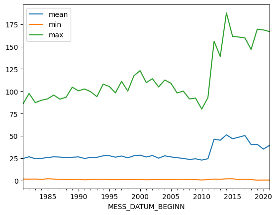

# Exercise Badges

    

# Evolving Weather Trends in Germany: Insights from Historical Data

This project analyzes data from the [German Weather Service](https://www.dwd.de/DE/Home/home_node.html)(DWD) in relation to the change in the number of weather phenomena over time. The data is accumulated annually from weather stations in Germany. This means that the analysis of the data will change after the next update.

The DWD data is, like this project, under the [Creative Commons BY 4.0 "CC BY 4.0"](https://creativecommons.org/licenses/by/4.0/) license.

The pipeline extracts the [data](https://opendata.dwd.de/climate_environment/CDC/observations_germany/climate/annual/weather_phenomena/historical/) from the DWD's Open Data Portal. The metadata and the data of the individual weather stations are extracted and stored in the project.sqlite database.


Start the pipeline
```sh
./project/pipeline.sh
```

The following weather phenomena are observed within the data sets:
- thunderstorms
- black ice
- sleet
- hail
- fog
- storms > 6 on the Beaufort scale
- storms > 8 on the Beaufort scale

The reports as wells as the jupyter notebook for the exploratory analysis for the project can be fould in the `project` folder of this repository.

The following image shows that the number of weather phenomena increases over time. For a more detailed analysis please have a look at the [Final report](./project/analysis-report.pdf)


## Files
[Data report](./project/data-report.pdf)  
[Final report](./project/analysis-report.pdf)